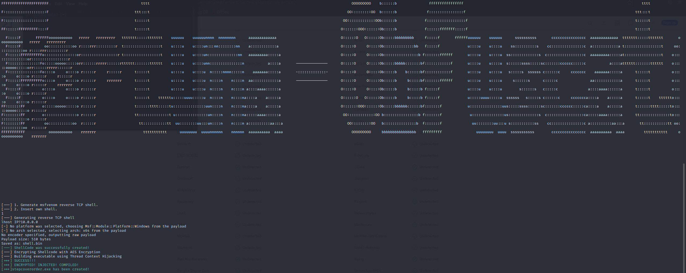

<h1 align="center">Fortuna Crypter FUD</h1>

     
    A Ransomware Builder and Crypter target Windows operating system --- Fully Undetectable as of data 27.02.22

Created for security researchers, enthusiasts and educators, This Crypter will allow you to experiance crypting shellcodes to avoid static engines of EDRs and varius AV programs, Microsoft Defender, YARA and etc... As for the time writen this tool does not target dynamic engines  

<b>Note: </b>That repo presented as a PoC ONLY and does not intented to be used for ilegal implimentations.

<h2 align="center">What's Here? (v1.0)</h2>
<ul>
    <li>Obfscating Static AV engines by using AES-256 Encryption</li>
    <li>Obfscating by using random generating program's name</li>
    <li>Dynamic process injection using Thread Context Hijacking</li>
</ul>

<h2 align="center">Disclaimer</h2>

Crypter is intended for educational and research purposes only. This software should not be used within any system or network for which you do not have permission, nor should it be used for any illegal or illicit purposes. The author takes no responsibility for any damages that may be caused by the software in this repository.
 This tool was writen as a PoC

Once compiled, the tool asumes you have all the requirments satesfied, once done will uses msfvenom to create a basic reverse TCP shell or inserting a custom made shellcode, the crypter will encrypt the shellcode using AES-256 will insert the key and encrypted hash to the loader creating an executable (exe) file whitch decrypts itself during run time injecting the shellcode using Thread Context Hijacking. </b>.

<h2 align="center">Screenshots</h2>

     
     
     
   

<h1 align="center">Getting Started</h1>
Installation is easy and user-friendly.
  
<ol>
    <li>Download or clone this repository</li>
    <li>Install the dependencies by running <b>sudo python3 installation.py</b></li>
  <li>Run <b>sudo python3 Fortuna_V1.0.py</b> to open the Builder and start building!</li>
</ol>
NOTE: Expected metasploit framework installed.

<h2 align="center">How Does it Work?</h2>

### Builder Loader and Crypter
The Crypter and Builder will be building and crypting the shellcode. Some of the options included presented here:

- AES-256 Encryption and run time decryption.
- Creating a basic TCP reverse shell (x64)
- Providing already created shellcode.
- Thread Contect Hijacking.
- Process injection using Native API commands.
- obfuscate executable's name to avoid some AV's signing features - will be using three random words to avoid suspicion.
